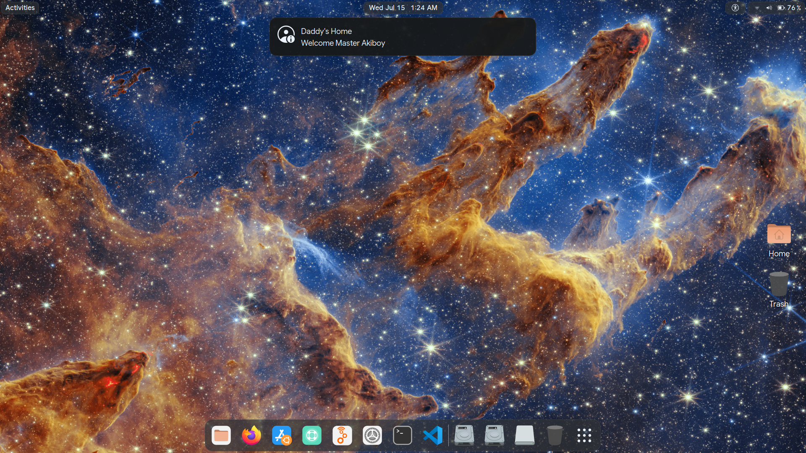

# Ubuntu USB Custom Notification
A lightweight background bash script for Ubuntu that monitors hardware connections to instantly play a custom audio sound and push a desktop notification banner when your specific pen drive is inserted.



This works only if the your specific pendrive(exact UUID) is mounted in your Ubuntu. For different pendrives, you can have different kind of notifications and sounds according to your creativity. I have used a random game sound that which i found in internet. Make sure that the audio file is in .wav format or .ogg format.

## Setup Instructions

### 1. Get your USB UUID
Plug in your USB drive and find its unique ID by running:
```bash
lsblk -o NAME,LABEL,UUID
```

### 2. Configure the Script
* Open `usb_welcome.sh` and replace `YOUR_USB_UUID_HERE` with your drive's actual UUID.
* Customize the notification text and sound file path inside the loop.
* [Suggestion: You can use Yamate Kudasai audio too 😂]

### 3. Make Executable
```bash
chmod +x usb_welcome.sh
```

### 4. Run on Startup
* Open **Startup Applications** in Ubuntu.
* Click **Add**.
* Set the command to: `bash /path/to/your/usb_welcome.sh`
